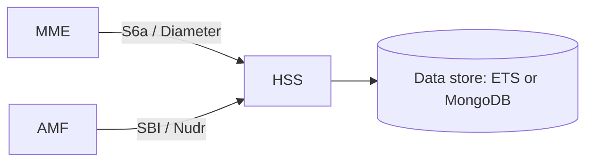
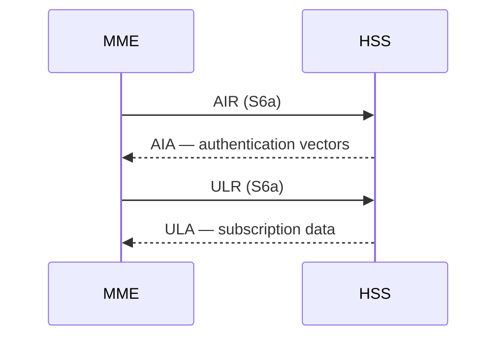
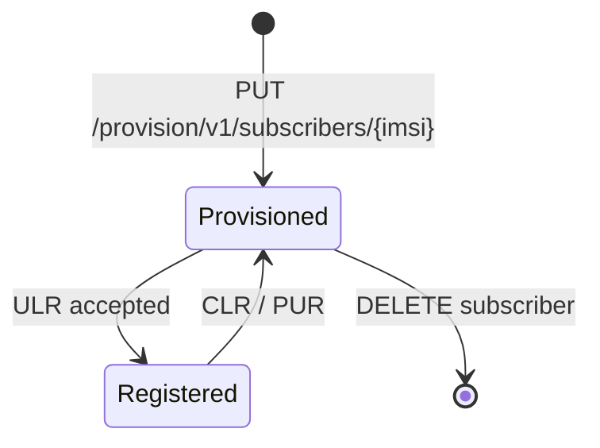

<!--
TEMPLATE / REFERENCE: Diagram conventions
This file is BOTH the conventions to follow AND a template to copy diagram blocks
from. Follow ../documentation-style.md §11. Author diagrams in Mermaid.
-->

# Diagram Conventions

**Applies to:** udr <version> · **Revised:** <YYYY-MM-DD>

Diagrams in HSS documentation follow these conventions so that they render
everywhere (GitHub, ExDoc), diff cleanly in review, and stay consistent across
documents.

## 1. Tooling

- Author every diagram in **Mermaid**, in a fenced ```` ```mermaid ```` block. Do not
  embed binary images for diagrams that Mermaid can express.
- Keep one diagram per block. A diagram that needs a paragraph of caveats is doing
  too much — split it.

## 2. Choosing the diagram type

| Show… | Use | Mermaid kind |
| --- | --- | --- |
| Deployment topology (nodes, network functions, links) | Deployment diagram | `flowchart` |
| A signalling flow over time (Attach, AIR/ULR, registration) | Sequence diagram | `sequenceDiagram` |
| A lifecycle (subscriber state, peer-connection state) | State diagram | `stateDiagram-v2` |

## 3. Labelling rules

- Name network functions with the defined abbreviations: `UE`, `MME`, `AMF`, `HSS`, `UDR`.
- Label every link or message with the interface it carries: `S6a`, `Cx`, `SBI`, `Nudr`.
- Use the exact command/operation names on messages: `AIR`, `ULR`, `PUR`, `CLR` for S6a; HTTP method + resource for SBI.
- Mark each diagram **normative** or **informative** in its caption. A normative diagram carries requirements (e.g. a mandated message order); an informative one aids understanding only.

## 4. Examples

### Deployment (informative)



### Signalling sequence (normative)

*The order of messages below is normative.*



### Lifecycle (informative)


