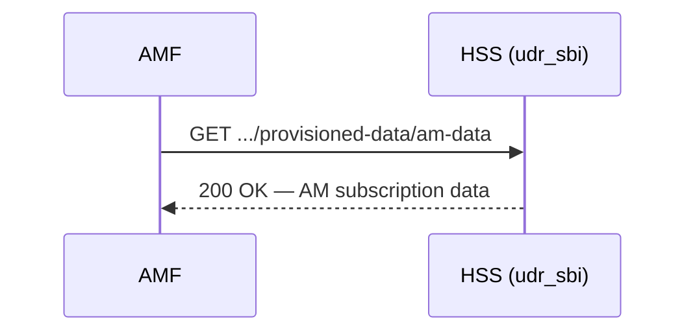

<!--
TEMPLATE: Interface / API Reference
Copy this file, remove the HTML comments, and fill in every field.
Follow ../documentation-style.md. One Interface Reference documents one interface
(e.g. S6a Diameter, the SBI Nudr-DR resource, or the Provisioning HTTP API).
Document only what the code actually implements. Mark anything unimplemented
explicitly — do not describe behaviour that does not exist.
-->

# Interface Reference: <Interface name, e.g. SBI — Nudr-DR>

**Applies to:** udr <version> · **Revised:** <YYYY-MM-DD>

## 1. Scope

<One paragraph: which interface this covers, which application implements it
(e.g. `udr_sbi`), and which 3GPP reference point or specification it follows.
State what is out of scope.>

## 2. Terms

<Define any abbreviation used below that is not in the shared glossary. Definition
states meaning only — no requirements.>

## 3. Transport and conventions

<State the facts a caller needs before any operation:>

- **Protocol / transport:** <e.g. HTTP/1.1 over TCP; or Diameter over TCP.>
- **Endpoint:** <default address and port, e.g. `127.0.0.1:8080`; the configurable parameter, e.g. `udr_sbi` `port`/`ip`.>
- **Base path:** <e.g. `/nudr-dr/v1`.>
- **Content type:** <e.g. `application/json`.>
- **Authentication:** <state plainly if there is none, and the consequence — e.g. "none; the listener `should` be bound to a trusted interface".>
- **Identifiers:** <how the key entity is addressed, e.g. `{ueId}` is an IMSI.>

## 4. Operations

<One row per operation the interface actually exposes. Give each a stable ID.>

| ID | Operation | Method / command | Resource / target |
| --- | --- | --- | --- |
| `IF-SBI-001` | Read AM subscription data | `GET` | `/nudr-dr/v1/subscription-data/{ueId}/provisioned-data/am-data` |
| `IF-SBI-002` | … | … | … |

## 5. Operation detail

<For each operation, a subsection with the full contract. Normative statements use
shall/should/may/can. Document the real request/response shapes by reading the
handler source; if a field or status code is not implemented, say so.>

### 5.1 `IF-SBI-001` — Read AM subscription data

- **Purpose** *(informative):* <what it returns and when a caller uses it.>
- **Request:**
  - Method and path: `GET /nudr-dr/v1/subscription-data/{ueId}/provisioned-data/am-data`
  - Path parameters: `ueId` — <type, e.g. IMSI string>.
  - Query parameters / headers / body: <list, or "none">.
- **Response:**
  - Success: <status code> with <body schema or reference>.
  - Pre-conditions: <e.g. the subscriber `shall` be provisioned; otherwise see errors>.
- **Errors:** <each error condition, the observable result (status/result code), and what it means>.
- **Example exchange:**
  ```http
  GET /nudr-dr/v1/subscription-data/001010000000001/provisioned-data/am-data HTTP/1.1
  Host: 127.0.0.1:8080

  HTTP/1.1 200 OK
  Content-Type: application/json

  { ... }
  ```

## 6. Sequence

<A Mermaid sequence diagram for a representative exchange (see
../templates/diagram-conventions.md). Mark normative or informative.>



## 7. Status / result codes

<Every status or result code the interface returns, with its meaning in this
interface's terms. For Diameter, list the Result-Code AVP values; for HTTP, the
status codes.>

| Code | Returned when | Notes |
| --- | --- | --- |
| `200 OK` | … | … |
| `404 Not Found` | … | … |

## 8. Verify

<How a caller confirms the interface is reachable and behaving — observable outcomes
only (see ../documentation-style.md §8). E.g. a curl returning the expected status,
or a Diameter CER answered by a CEA.>
