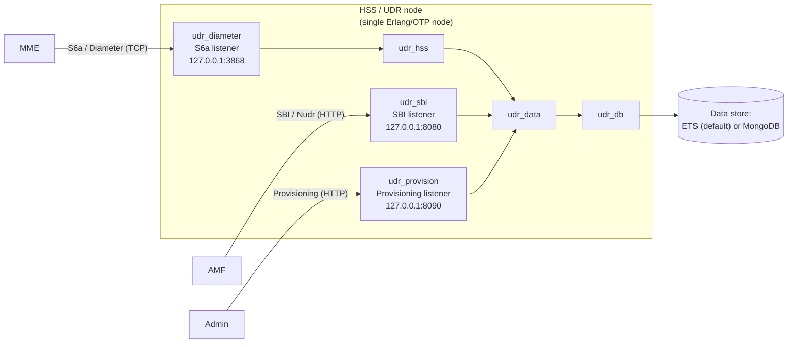
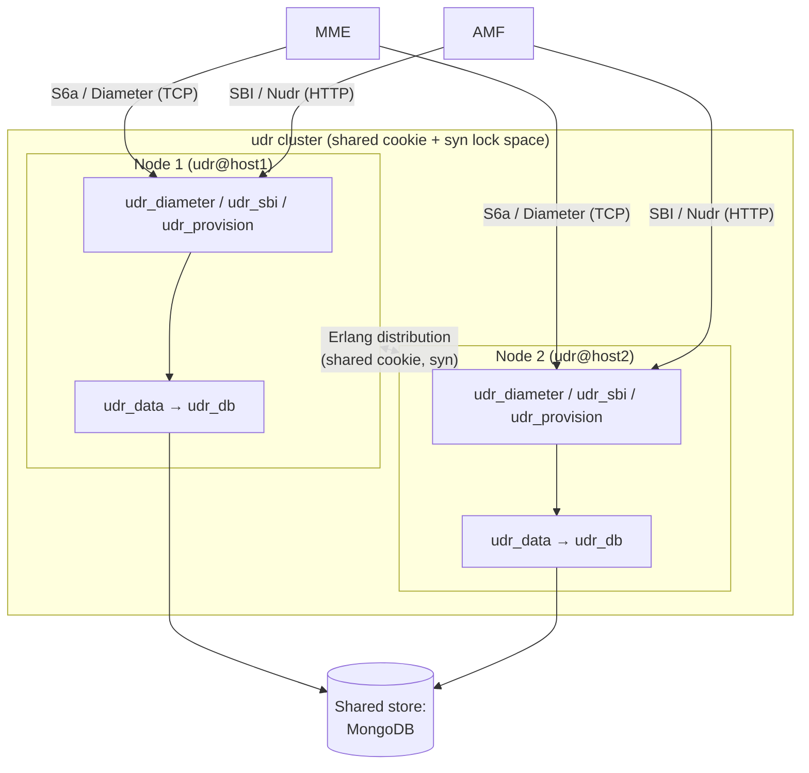
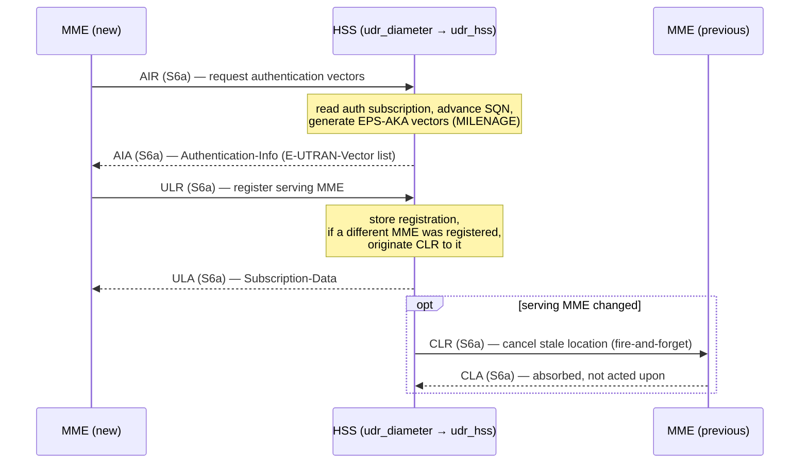
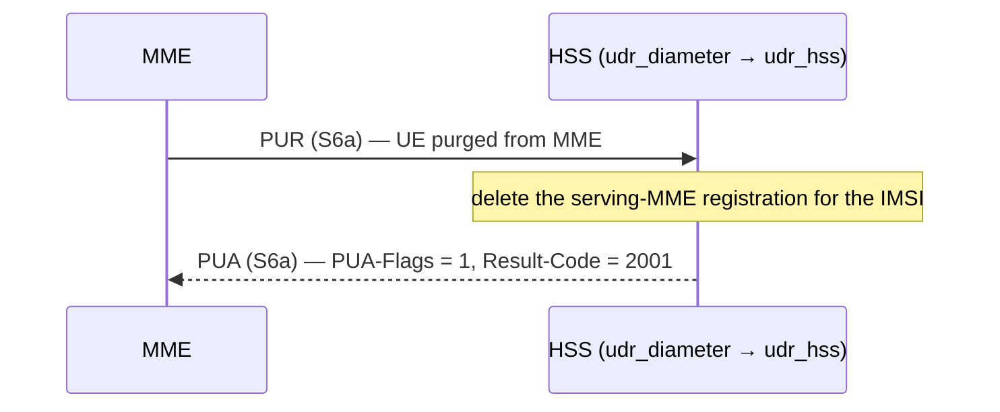
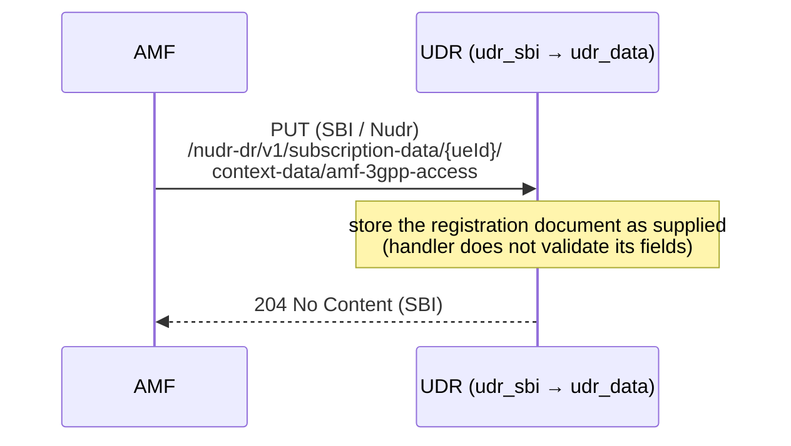
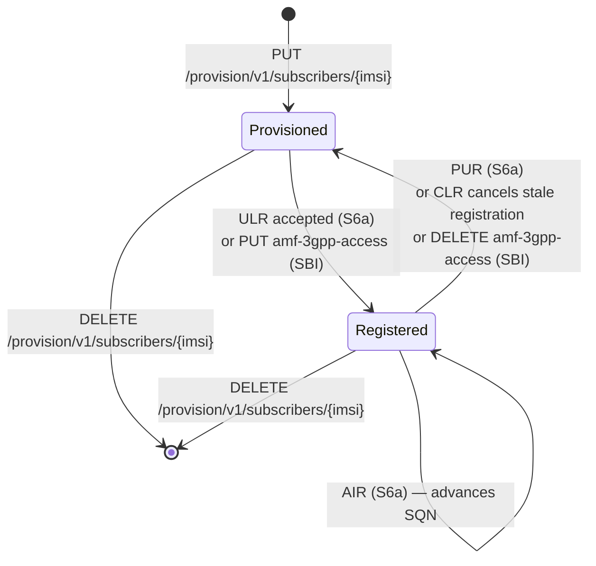

# Diagrams

**Applies to:** udr 0.1.0 · **Revised:** 2026-06-08

This directory holds the shared diagram set for the HSS operator manual: the canonical deployment, sequence, and state diagrams that other documents point to instead of redrawing. Every diagram here follows the project [diagram conventions](../../../.claude/skills/documenting-hss/templates/diagram-conventions.md): it is authored in Mermaid, labels each link with the interface it carries ([S6a](../glossary.md), [SBI](../glossary.md), [Nudr](../glossary.md)), uses the [glossary](../glossary.md) abbreviations, and is marked **normative** or **informative**.

Terms and abbreviations (HSS, UDR, UDM, MME, AMF, S6a, SBI, Nudr, IMSI, AIR, ULR, PUR, CLR, ETS, MongoDB, `syn`) are defined once in the [glossary](../glossary.md) and are not redefined here.

> [!NOTE]
> This index is informative. A diagram marked *normative* below carries a requirement — for example, a mandated message order. A diagram marked *informative* aids understanding only and imposes no obligation. The marking appears in each diagram's own caption.

## How to read the markings

| Marking | Meaning |
| --- | --- |
| **Normative** | The diagram states a requirement. The order or relationship it shows is part of the contract and is consistent with the matching interface reference. |
| **Informative** | The diagram is explanatory. It depicts how parts relate or interact but imposes no obligation. |

## Contents

| # | Diagram | Kind | Marking | Shows |
| --- | --- | --- | --- | --- |
| 1 | [Single-node deployment](#1-single-node-deployment-informative) | Deployment (`flowchart`) | Informative | The three listeners and the data store on one Erlang/OTP node. |
| 2 | [Clustered deployment](#2-clustered-deployment-informative) | Deployment (`flowchart`) | Informative | A multi-node cluster sharing a distribution cookie and the `syn` lock space, with a shared MongoDB store. |
| 3 | [LTE attach: AIR then ULR (with conditional CLR)](#3-lte-attach-air-then-ulr-normative) | Sequence (`sequenceDiagram`) | Normative | The S6a message order for an LTE attach, including the HSS-initiated CLR to a previous MME. |
| 4 | [Purge: PUR](#4-purge-pur-normative) | Sequence (`sequenceDiagram`) | Normative | The S6a PUR/PUA exchange that clears a serving-MME registration. |
| 5 | [5G registration over the SBI: PUT amf-3gpp-access](#5-5g-registration-over-the-sbi-put-amf-3gpp-access-normative) | Sequence (`sequenceDiagram`) | Normative | The SBI write that records the AMF serving-node registration. |
| 6 | [Subscriber and registration lifecycle](#6-subscriber-and-registration-lifecycle-informative) | State (`stateDiagram-v2`) | Informative | The provisioned → registered → purged/cancelled → deleted lifecycle. |

> [!NOTE]
> The deployment and LTE-attach diagrams here are kept consistent with the topology in [overview.md §5](../overview.md#5-deployment-topology) and the S6a sequence in [overview.md §6](../overview.md#6-lte-attach-against-the-hss) and [interfaces/s6a.md §6](../interfaces/s6a.md#6-sequence). The message names and their order do not differ between those documents and this one.

---

## 1. Single-node deployment (informative)

*The following deployment diagram is informative.*

A single Erlang/OTP node serves all three entry paths. The shipped listeners bind to the loopback address `127.0.0.1`, so a fresh checkout exposes no port to the network. Binding a listener to a routable address is configuration; see the [configuration references](../configuration/README.md). The default data store is in-memory [ETS](../glossary.md); [MongoDB](../glossary.md) `may` be selected in its place.

> [!CAUTION]
> All three listeners serve plaintext transport: the SBI and provisioning listeners serve cleartext [HTTP](../glossary.md), and the S6a listener serves plain [TCP](../glossary.md). None terminates [TLS](../glossary.md). The provisioning API performs no authentication, and the SBI authentication-subscription resource returns [Ki](../glossary.md) and [OPc](../glossary.md) in clear. See [security.md](../security.md).

## 2. Clustered deployment (informative)

*The following deployment diagram is informative.*

Two or more nodes form a cluster when they share an Erlang distribution cookie and reach one another's distribution ports. The cluster shares the per-[IMSI](../glossary.md) session-lock space provided by `udr_cluster` over [`syn`](../glossary.md), so that concurrent signaling for one subscriber serializes across nodes. A cluster `should` use the [MongoDB](../glossary.md) backend so that all nodes read and write one shared, persistent store; the default [ETS](../glossary.md) backend is per-node and is not shared. Cluster formation is covered in the [cluster runbook](../operations/cluster.md) and the [cluster configuration reference](../configuration/cluster.md).

> [!CAUTION]
> The Erlang distribution cookie is the cluster trust boundary. A host that knows the cookie and reaches the distribution port can run arbitrary code on every node. The cookie `shall` be treated as a secret, and distribution and [`epmd`](../glossary.md) `shall` be confined to a trusted network. See [security.md](../security.md) and [`RUN-SECRETS-001`](../operations/secrets.md).

## 3. LTE attach: AIR then ULR (normative)

*The following sequence diagram is normative: the message order for an LTE attach — AIR then ULR, with the conditional CLR to a previously registered MME — is the order in which the MME and HSS exchange S6a messages. It matches [interfaces/s6a.md §6](../interfaces/s6a.md#6-sequence).*

> [!NOTE]
> The CLR is emitted only when the ULR registers a serving MME that differs from the one already registered. It is sent fire-and-forget; the CLA is absorbed. The full AVP-level contract is in [interfaces/s6a.md §5.4](../interfaces/s6a.md#54-if-s6a-004--clr--cla-hss-initiated).

## 4. Purge: PUR (normative)

*The following sequence diagram is normative: it shows the S6a PUR/PUA exchange. It matches [interfaces/s6a.md §5.3](../interfaces/s6a.md#53-if-s6a-003--pur--pua).*

> [!NOTE]
> A PUR for a subscriber that has no subscription profile returns the 3GPP error `5001` (DIAMETER_ERROR_USER_UNKNOWN) rather than a success PUA; see [interfaces/s6a.md §7](../interfaces/s6a.md#7-status--result-codes).

## 5. 5G registration over the SBI: PUT amf-3gpp-access (normative)

*The following sequence diagram is normative: it shows the SBI write that records an AMF serving-node registration. It matches [interfaces/sbi.md §5.4](../interfaces/sbi.md#54-if-sbi-004--put-amf-3gpp-access).*

> [!NOTE]
> The `{ueId}` path segment `shall` be of the form `imsi-<digits>`; any other form returns `400`. The PUT body is stored as-is and is not validated. The stored document is the same registration context a successful S6a ULR writes; see [interfaces/sbi.md §5.3](../interfaces/sbi.md#53-if-sbi-003--get-amf-3gpp-access).

## 6. Subscriber and registration lifecycle (informative)

*The following state diagram is informative. It shows the lifecycle of a subscriber record and its serving-node registration; it does not mandate a transition order.*

A subscriber begins **Provisioned** when an admin creates it through the provisioning API. It becomes **Registered** when an MME's ULR (or an AMF's SBI PUT amf-3gpp-access) records a serving node. A PUR, or a CLR-driven cancellation when the subscriber moves to a different serving node, clears that registration and returns the subscriber to the provisioned-but-unregistered state. A `DELETE` through the provisioning API removes the subscriber record entirely.

> [!NOTE]
> With the default [ETS](../glossary.md) backend, all of this state lives only in the node's memory and is lost on restart. Persistence across a restart requires the [MongoDB](../glossary.md) backend; see the [operations README](../operations/README.md#persistence-model--read-this-first).

## Related documents

- [overview.md](../overview.md) — the architecture narrative these diagrams summarize.
- [interfaces/s6a.md](../interfaces/s6a.md) and [interfaces/sbi.md](../interfaces/sbi.md) — the normative interface contracts behind the sequence diagrams.
- [security.md](../security.md) — the exposures the deployment diagrams flag.
- [operations/cluster.md](../operations/cluster.md) — forming the cluster shown in diagram 2.
