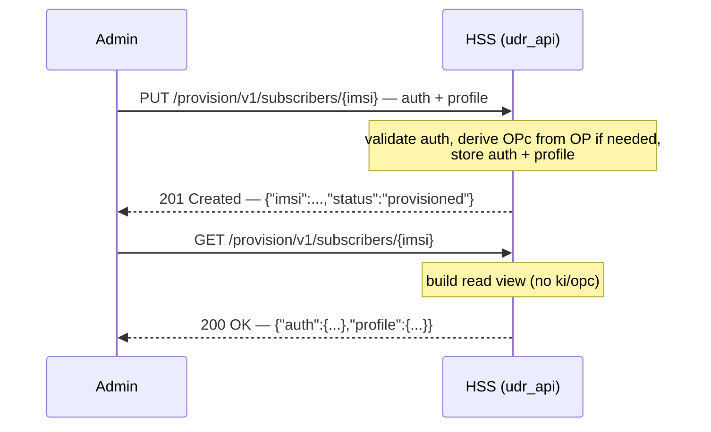

# Interface Reference: Provisioning API (`udr_api`)

**Applies to:** udr 0.1.0 · **Revised:** 2026-06-08

## 1. Scope

This reference covers the admin provisioning HTTP API implemented by the `udr_api` application. It documents the single resource the API exposes — a subscriber addressed by [IMSI](../glossary.md) — and its three methods: create-or-replace (`PUT`), read (`GET`), and delete (`DELETE`). It gives the exact request body schema and its validation, the read view (which fields are withheld), and every HTTP status code the handler returns.

The bind address and port are configuration, covered in the [provisioning configuration reference](../configuration/provisioning.md). The cryptography that derives OPc from OP, and the on-disk subscriber schema, are out of scope.

> [!NOTE]
> This is the only resource the application routes (confirmed in `udr_api_app.erl`: a single Cowboy route, `/provision/v1/subscribers/:imsi`).

## 2. Terms

Terms used below — IMSI, Ki, OPc, OP, AMF (Authentication Management Field), SQN, MILENAGE — are defined in the [glossary](../glossary.md). One name is local to this interface:

- **auth object** — the JSON object under the `auth` key of a `PUT` body that carries the per-subscriber authentication credentials and parameters.

## 3. Transport and conventions

- **Protocol / transport:** HTTP over TCP, served by Cowboy (`cowboy:start_clear`, cleartext; confirmed in `udr_api_app.erl`).
- **Endpoint:** the `udr_api` `ip` / `port` keys; shipped default `127.0.0.1:8090`. See the [configuration reference](../configuration/provisioning.md).
- **Resource path:** `/provision/v1/subscribers/{imsi}`, where `{imsi}` is the [IMSI](../glossary.md) taken verbatim as the storage key (confirmed in `udr_api_subscriber_h.erl`, `init/2`). Unlike the SBI, there is no `imsi-` prefix and no format check on `{imsi}`.
- **Content type:** all responses are `application/json` (confirmed in `reply_json/3`).
- **Authentication:** none. The handler performs no credential check on any request.

> [!CAUTION]
> The provisioning API is unauthenticated. Any caller that can reach the listener can create, read, and delete any subscriber. The listener `shall` be bound only to a trusted management interface; this requirement and its rationale are in the [provisioning configuration reference](../configuration/provisioning.md). All hex byte values (Ki, OPc, OP, AMF) cross the wire in clear.

- **Identifiers:** `{imsi}` is the subscriber key; the same value addresses the subscriber on the S6a and SBI interfaces.

## 4. Operations

| ID | Operation | Method | Resource |
| --- | --- | --- | --- |
| `IF-PROV-001` | Create or replace a subscriber | `PUT` | `/provision/v1/subscribers/{imsi}` |
| `IF-PROV-002` | Read a subscriber (secrets withheld) | `GET` | `/provision/v1/subscribers/{imsi}` |
| `IF-PROV-003` | Delete a subscriber | `DELETE` | `/provision/v1/subscribers/{imsi}` |

## 5. Operation detail

### 5.1 `IF-PROV-001` — PUT subscriber

- **Purpose** *(informative):* create a new subscriber or replace an existing one with the supplied authentication credentials and optional profile.
- **Request:** `PUT /provision/v1/subscribers/{imsi}`, `application/json`. The body `shall` be a JSON object containing an `auth` object; it `may` contain a `profile` object.
- **Request body schema** (confirmed in `udr_api_subscriber_h.erl`, `handle(<<"PUT">>, ...)` and `udr_api_subscriber.erl`, `auth_from_json/1`):

  | Field | Location | Required | Type | Meaning |
  | --- | --- | --- | --- | --- |
  | `auth` | top level | yes | object | The authentication object. Its absence returns `400`. |
  | `auth.ki` | in `auth` | yes | hex string | The subscriber's permanent key [Ki](../glossary.md). Decoded from hex to bytes. |
  | `auth.amf` | in `auth` | yes | hex string | The [AMF (Authentication Management Field)](../glossary.md). Decoded from hex to bytes. |
  | `auth.opc` | in `auth` | one of `opc` / `op` | hex string | The [OPc](../glossary.md). Used directly if present. |
  | `auth.op` | in `auth` | one of `opc` / `op` | hex string | The [OP](../glossary.md). When `opc` is absent, OPc is derived from `op` and `ki` with MILENAGE at provisioning time. |
  | `auth.algorithm` | in `auth` | no | string | The authentication algorithm. Defaults to `"milenage"`. Only `"milenage"` is accepted; any other value returns `400`. |
  | `auth.sqn` | in `auth` | no | integer | The initial [SQN](../glossary.md). Defaults to `0`. |
  | `profile` | top level | no | object | The subscription profile, stored as-is. Defaults to an empty object. |

- **Validation** (confirmed in the handler's `try` / `catch` and `auth_from_json/1`):
  - A body that is not a JSON object, or that lacks the `auth` object, returns `400` with `{"error":"missing 'auth' object"}`.
  - An `auth` object that supplies neither `opc` nor `op` returns `400` with `{"error":"auth requires 'opc' or 'op' (and 'ki','amf')"}` (the `badarg` raised in `opc/3`).
  - An `auth` object that lacks `ki` or `amf`, or supplies an unknown `algorithm`, returns `400` with `{"error":"invalid request body"}` (a `function_clause` or other error caught by the handler).
- **Response — success:** `201 Created`, body `{"imsi":"<imsi>","status":"provisioned"}`. The same `201` is returned whether the subscriber was newly created or replaced (the store is create-or-replace; confirmed in `store/3` over `udr_data:put_*`).
- **Errors:** see §7. A storage failure returns `500`.
- **Example exchange:**
  ```http
  PUT /provision/v1/subscribers/001010000000001 HTTP/1.1
  Host: 127.0.0.1:8090
  Content-Type: application/json

  {
    "auth": {
      "ki":  "465b5ce8b199b49faa5f0a2ee238a6bc",
      "opc": "cd63cb71954a9f4e48a5994e37a02baf",
      "amf": "8000"
    },
    "profile": {}
  }

  HTTP/1.1 201 Created
  Content-Type: application/json

  {"imsi":"001010000000001","status":"provisioned"}
  ```

### 5.2 `IF-PROV-002` — GET subscriber

- **Purpose** *(informative):* read back a subscriber's authentication metadata and profile, without exposing the secret key material.
- **Request:** `GET /provision/v1/subscribers/{imsi}`. No body.
- **Response — success:** `200 OK`, `application/json`. The body is `{"auth": <metadata>, "profile": <profile>}` (confirmed in `udr_api_subscriber.erl`, `to_view/2`):
  - `auth.algorithm` — the stored algorithm (defaults to `"milenage"`).
  - `auth.amf` — the AMF, hex-encoded.
  - `auth.sqn` — the current SQN.
  - `profile` — the stored subscription profile, or `{}` when no profile was stored.
- **Withheld fields** *(normative):* the read view `shall not` include `ki` or `opc`. Only `algorithm`, `amf`, and `sqn` appear under `auth` (confirmed in `to_view/2`, which constructs `auth` from those three keys only).
- **Errors:** `404` when no authentication subscription exists for the IMSI (confirmed in the handler's `GET` clause).
- **Example exchange:**
  ```http
  GET /provision/v1/subscribers/001010000000001 HTTP/1.1
  Host: 127.0.0.1:8090

  HTTP/1.1 200 OK
  Content-Type: application/json

  {"auth":{"algorithm":"milenage","amf":"8000","sqn":0},"profile":{}}
  ```

### 5.3 `IF-PROV-003` — DELETE subscriber

- **Purpose** *(informative):* remove a subscriber entirely.
- **Request:** `DELETE /provision/v1/subscribers/{imsi}`. No body.
- **Effect:** the authentication subscription, the subscription profile, and the 3GPP access registration for the IMSI are all deleted (confirmed in the handler's `DELETE` clause, three `udr_data:delete_*` calls).
- **Response — success:** `204 No Content`, empty body. The delete is idempotent: a `DELETE` for an unknown IMSI also returns `204` (each storage delete returns `ok`).
- **Errors:** none distinct from success; the handler does not return `404` for `DELETE`.

## 6. Sequence

*The following sequence diagram is informative; it shows the provision-then-read flow.*



## 7. Status / result codes

Every status code below is returned by `udr_api_subscriber_h.erl`. Bodies are `application/json`; error bodies are `{"error":"<message>"}`.

| Code | Returned when | Confirmed in |
| --- | --- | --- |
| `201 Created` | A `PUT` validated and stored the subscriber (created or replaced). | `handle(<<"PUT">>, ...)` |
| `200 OK` | A `GET` found the subscriber; body is the read view (no secrets). | `handle(<<"GET">>, ...)` |
| `204 No Content` | A `DELETE` completed (including for an unknown IMSI). | `handle(<<"DELETE">>, ...)` |
| `400 Bad Request` | A `PUT` body is not a JSON object, lacks `auth`, lacks `ki`/`amf`, supplies neither `opc` nor `op`, or names an unknown `algorithm`. | `handle(<<"PUT">>, ...)` `try`/`catch`; `auth_from_json/1`, `opc/3`, `algo/1` |
| `404 Not Found` | A `GET` found no subscriber for the IMSI; or any method other than `PUT`/`GET`/`DELETE` was used. | `handle(<<"GET">>, ...)`; final `handle/3` clause |
| `500 Internal Server Error` | A `PUT` failed at the storage layer. | `handle(<<"PUT">>, ...)`, `store/3` |

> [!NOTE]
> A method other than `PUT`, `GET`, or `DELETE` falls through to the final handler clause and returns `404` with `{"error":"not found"}` (not `405`). This differs from the SBI registration resource, which returns `405` for an unsupported method.

## 8. Verify

- Confirm the listener answers: a `GET` for an unprovisioned subscriber returns `404`, which confirms the listener is reachable.

  ```sh
  curl -s -o /dev/null -w '%{http_code}\n' \
    http://127.0.0.1:8090/provision/v1/subscribers/001010000000001
  ```

  The expected status on a reachable node with no such subscriber is `404`.

- Confirm a provision: a `PUT` with a valid `auth` object returns `201` and `{"imsi":...,"status":"provisioned"}`.

  ```sh
  curl -s -X PUT -H 'content-type: application/json' \
    -d '{"auth":{"ki":"465b5ce8b199b49faa5f0a2ee238a6bc","opc":"cd63cb71954a9f4e48a5994e37a02baf","amf":"8000"}}' \
    http://127.0.0.1:8090/provision/v1/subscribers/001010000000001
  ```

  The expected status is `201`.

- Confirm secrets are withheld on read: a `GET` of the subscriber just provisioned returns `200` with an `auth` object that contains `algorithm`, `amf`, and `sqn`, and contains no `ki` or `opc`.

- Confirm validation: a `PUT` whose `auth` supplies neither `opc` nor `op` returns `400` with body `{"error":"auth requires 'opc' or 'op' (and 'ki','amf')"}`.
