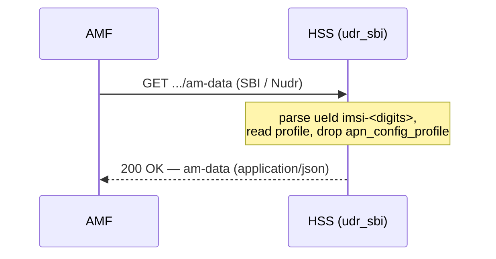

# Interface Reference: SBI — Nudr-DR (`udr_sbi`)

**Applies to:** udr 0.1.0 · **Revised:** 2026-06-08

## 1. Scope

This reference covers the [Nudr](../glossary.md)-flavored 5G [SBI](../glossary.md) data-repository interface implemented by the `udr_sbi` application. It documents the four operations the application exposes over HTTP: read the authentication-subscription resource, read the am-data resource, and read, write, or delete the amf-3gpp-access registration context. For each it gives the method, the request body (where one applies), the JSON response shape, and every HTTP status code the handler returns.

The bind address and port are configuration, covered in the [SBI configuration reference](../configuration/sbi.md). The on-disk subscriber schema and the cryptography behind the credentials are out of scope.

> [!NOTE]
> The resource paths follow the 3GPP Nudr-DR layout, but this is a focused implementation: only the three resources in §4 are routed (confirmed in `udr_sbi_app.erl`, the Cowboy dispatch). Resources of the full Nudr_DataRepository service that are not listed are not implemented.

## 2. Terms

Terms used below — SBI, Nudr, AMF (Access and Mobility Management Function), IMSI, Ki, OPc, SQN — are defined in the [glossary](../glossary.md). Two further names are local to this interface:

- **ueId** — the path segment that identifies the subscriber. This interface accepts only the form `imsi-<digits>` (see §3).
- **ProblemDetails** — the 3GPP `application/problem+json` error body, an object with `status`, `title`, and `detail` (confirmed in `udr_sbi.erl`, `problem/4`).

## 3. Transport and conventions

- **Protocol / transport:** HTTP over TCP, served by Cowboy (`cowboy:start_clear`, cleartext; confirmed in `udr_sbi_app.erl`).
- **Endpoint:** the `udr_sbi` `ip` / `port` keys; shipped default `127.0.0.1:8080`. See the [configuration reference](../configuration/sbi.md).
- **Base path:** `/nudr-dr/v1/subscription-data/{ueId}`.
- **Content type:** success responses are `application/json`; error responses are `application/problem+json` (confirmed in `udr_sbi.erl`).
- **Authentication:** none. The handlers perform no credential check. The listener `should` be bound to a trusted interface (see §7 and the [configuration reference](../configuration/sbi.md)).
- **Identifiers:** `{ueId}` `shall` be of the form `imsi-<digits>`, where `<digits>` is the [IMSI](../glossary.md) and is non-empty. Any other form returns `400` (confirmed in `udr_sbi.erl`, `ue_imsi/1`). The IMSI used as the storage key is the part after `imsi-`.

## 4. Operations

| ID | Operation | Method | Resource (under `/nudr-dr/v1/subscription-data/{ueId}`) |
| --- | --- | --- | --- |
| `IF-SBI-001` | Read the authentication subscription | `GET` | `/authentication-data/authentication-subscription` |
| `IF-SBI-002` | Read Access-and-Mobility (am-data) | `GET` | `/provisioned-data/am-data` |
| `IF-SBI-003` | Read the serving-node registration | `GET` | `/context-data/amf-3gpp-access` |
| `IF-SBI-004` | Create or replace the serving-node registration | `PUT` | `/context-data/amf-3gpp-access` |
| `IF-SBI-005` | Delete the serving-node registration | `DELETE` | `/context-data/amf-3gpp-access` |

## 5. Operation detail

### 5.1 `IF-SBI-001` — GET authentication-subscription

- **Purpose** *(informative):* return the subscriber's authentication credentials and parameters.
- **Request:** `GET .../authentication-data/authentication-subscription`. No body.
- **Response — success:** `200 OK`, `application/json`. The body is the stored authentication subscription with the internal CAS metadata removed and the `ki`, `opc`, and `amf` byte fields hex-encoded in lowercase; other fields (`algorithm`, `sqn`) pass through unchanged (confirmed in `udr_sbi.erl`, `auth_view/1`).
- **Errors:** `404` when no authentication subscription exists for the IMSI; `400` for a malformed `ueId` (confirmed in `udr_sbi_auth_h.erl`).
- **Example exchange:**
  ```http
  GET /nudr-dr/v1/subscription-data/imsi-001010000000001/authentication-data/authentication-subscription HTTP/1.1
  Host: 127.0.0.1:8080

  HTTP/1.1 200 OK
  Content-Type: application/json

  {"algorithm":"milenage","ki":"465b...","opc":"cd63...","amf":"8000","sqn":0}
  ```

> [!WARNING]
> This resource returns the long-term key material — [Ki](../glossary.md) and [OPc](../glossary.md) — in clear lowercase hex. This is consistent with how the quickstart already flags the same response. On a real deployment the SBI listener `shall not` be exposed to an untrusted network. Hardening of the SBI is covered in [security.md](../security.md).

### 5.2 `IF-SBI-002` — GET am-data

- **Purpose** *(informative):* return the Access-and-Mobility subscription data for the subscriber.
- **Request:** `GET .../provisioned-data/am-data`. No body.
- **Response — success:** `200 OK`, `application/json`. The body is the stored subscription profile with the internal CAS metadata removed **and the `apn_config_profile` field dropped** — am-data is the profile minus the APN (Session-Management) configuration (confirmed in `udr_data.erl`, `get_am_subscription/1`, which removes the `apn_config_profile` key).
- **Errors:** `404` when no subscription profile exists for the IMSI; `400` for a malformed `ueId` (confirmed in `udr_sbi_am_h.erl`).

### 5.3 `IF-SBI-003` — GET amf-3gpp-access

- **Purpose** *(informative):* return the current serving-node (MME/AMF) registration for the subscriber.
- **Request:** `GET .../context-data/amf-3gpp-access`. No body.
- **Response — success:** `200 OK`, `application/json`. The body is the stored registration document with internal CAS metadata removed (confirmed in `udr_sbi_registration_h.erl` and `udr_data.erl`, `get_3gpp_access_registration/1`). On the S6a path this document is written by a `ULR` and carries `serving_mme_host`, `serving_mme_realm`, `status`, `rat_type`, `visited_plmn`, and `updated_at`.
- **Errors:** `404` when there is no registration for the IMSI; `400` for a malformed `ueId`.

### 5.4 `IF-SBI-004` — PUT amf-3gpp-access

- **Purpose** *(informative):* create or replace the serving-node registration directly over the SBI.
- **Request:** `PUT .../context-data/amf-3gpp-access`, `application/json`. The body `shall` be a JSON object; it is stored as-is under the registration key (confirmed in `udr_sbi_registration_h.erl`, `handle(<<"PUT">>, ...)`). The handler does not validate the object's fields.
- **Response — success:** `204 No Content`, empty body.
- **Errors:** `400` when the body is not a JSON object or is invalid JSON; `400` for a malformed `ueId`; `500` on a storage error (confirmed in the same handler).

### 5.5 `IF-SBI-005` — DELETE amf-3gpp-access

- **Purpose** *(informative):* clear the serving-node registration for the subscriber.
- **Request:** `DELETE .../context-data/amf-3gpp-access`. No body.
- **Response — success:** `204 No Content`, empty body. The delete is idempotent: a `DELETE` for an IMSI with no registration also returns `204` (the storage delete returns `ok`; confirmed in `udr_sbi_registration_h.erl` and `udr_data.erl`, `delete_3gpp_access_registration/1`).
- **Errors:** `400` for a malformed `ueId`; `500` on a storage error.

## 6. Sequence

*The following sequence diagram is informative; it shows one representative read over the SBI.*



## 7. Status / result codes

Every status code below is returned by the handler source named. Success and `204` are returned directly; `400`, `404`, `405`, and `500` are returned as `application/problem+json` ProblemDetails.

| Code | Returned when | Confirmed in |
| --- | --- | --- |
| `200 OK` | A `GET` (`IF-SBI-001`/`002`/`003`) found the resource. Body is `application/json`. | `udr_sbi_auth_h.erl`, `udr_sbi_am_h.erl`, `udr_sbi_registration_h.erl` |
| `204 No Content` | A `PUT` (`IF-SBI-004`) stored the registration, or a `DELETE` (`IF-SBI-005`) completed (including when nothing was registered). | `udr_sbi_registration_h.erl` |
| `400 Bad Request` | The `ueId` is not `imsi-<digits>`; or, for `PUT`, the body is not a JSON object or is invalid JSON. | all three handlers (`ue_imsi/1`); `udr_sbi_registration_h.erl` (`PUT` body) |
| `404 Not Found` | A `GET` found no resource for the IMSI (no authentication subscription, no am-data, or no registration). | `udr_sbi_auth_h.erl`, `udr_sbi_am_h.erl`, `udr_sbi_registration_h.erl` |
| `405 Method Not Allowed` | A method other than the allowed set is used on a resource (e.g. `PUT` on authentication-subscription or am-data, which are `GET`-only). | all three handlers (final `handle/3` clause) |
| `500 Internal Server Error` | A `PUT` or `DELETE` on amf-3gpp-access failed at the storage layer. | `udr_sbi_registration_h.erl` |

## 8. Verify

- Confirm the listener answers: a `GET` for an unprovisioned subscriber returns `404`, which confirms the listener is reachable.

  ```sh
  curl -s -o /dev/null -w '%{http_code}\n' \
    http://127.0.0.1:8080/nudr-dr/v1/subscription-data/imsi-001010000000001/provisioned-data/am-data
  ```

  The expected status on a reachable node with no such subscriber is `404`.

- Confirm `ueId` validation: a request with a `ueId` that is not `imsi-<digits>` returns `400` with an `application/problem+json` body whose `detail` is `invalid ueId (expected imsi-<digits>)`.

  ```sh
  curl -s -o /dev/null -w '%{http_code}\n' \
    http://127.0.0.1:8080/nudr-dr/v1/subscription-data/001010000000001/provisioned-data/am-data
  ```

  The expected status is `400`.

- Confirm a read of a provisioned subscriber: a `GET` on `.../authentication-data/authentication-subscription` returns `200 OK` with the `ki`, `opc`, and `amf` fields hex-encoded.
