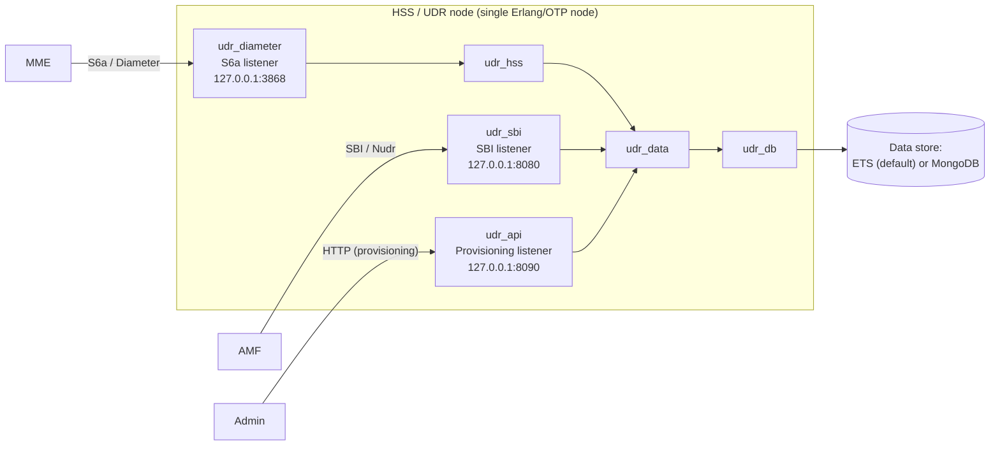
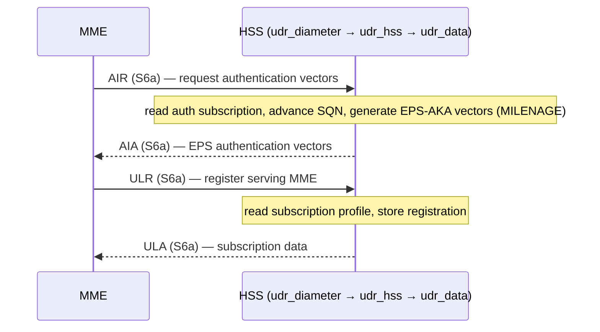

# Architecture and Data Flow

**Applies to:** udr 0.1.0 · **Revised:** 2026-06-08

This document describes what the system is, the role of each umbrella application, and how a request flows through the system on each of its three entry paths. It is primarily informative: it builds the mental model an operator needs before installing the system ([install.md](install.md)) or running it ([quickstart.md](quickstart.md)).

Terms and abbreviations (HSS, UDR, UDM, MME, AMF, S6a, SBI, Nudr, IMSI, AIR, ULR, PUR, CLR, ETS, EPS-AKA, MILENAGE) are defined once in the [glossary](glossary.md) and are not redefined here.

## 1. What the system is

> [!NOTE]
> This section is informative.

The `udr` project is a converged 3GPP [HSS](glossary.md) and [UDR](glossary.md) / [UDM](glossary.md), written in [Erlang/OTP](glossary.md). A single node serves three roles at once:

- the [HSS](glossary.md) of an [EPC](glossary.md), reached by an [MME](glossary.md) over the [S6a](glossary.md) Diameter interface;
- a 5G [UDR](glossary.md) that exposes subscriber data over a [Nudr](glossary.md)-flavoured [SBI](glossary.md);
- an admin provisioning service that creates, reads, and deletes subscribers by [IMSI](glossary.md).

The default data backend is in-memory [ETS](glossary.md), so a fresh checkout runs with no external database. A [MongoDB](glossary.md) backend can be selected by configuration in place of ETS.

## 2. The umbrella applications

> [!NOTE]
> This section is informative. It describes the internal structure so that later references to an application name are unambiguous; it imposes no operator obligation.

The system is a [rebar3](glossary.md) umbrella. Each application has a single, well-scoped responsibility.

| Application | Responsibility |
| --- | --- |
| `udr_crypto` | Authentication crypto primitives: [MILENAGE](glossary.md) f1–f5 / f1\* / f5\* / OPc, and EPS-AKA vector generation. |
| `udr_db` | Pluggable generic document store. Selects a backend (ETS or MongoDB) at runtime. |
| `udr_db_mongo` | The [MongoDB](glossary.md) backend for `udr_db`. Loaded but not auto-started unless selected. |
| `udr_data` | The [Nudr](glossary.md)-shaped data-access seam between the HSS logic and `udr_db`. |
| `udr_cluster` | Cluster-wide per-[IMSI](glossary.md) session locking over [`syn`](glossary.md). |
| `udr_hss` | [S6a](glossary.md) HSS application logic: [AIR](glossary.md), [ULR](glossary.md), [PUR](glossary.md). |
| `udr_diameter` | The S6a Diameter wire layer: codec and transport. Originates the HSS-initiated [CLR](glossary.md). |
| `udr_sbi` | The Nudr-flavoured 5G [SBI](glossary.md) data-repository HTTP server. |
| `udr_api` | The admin provisioning HTTP API. |
| `udr_otel` | [OpenTelemetry](glossary.md) setup: metric instruments and the span exporter. |
| `udr` | The top-level release application. |

## 3. The data-access seam

> [!IMPORTANT]
> The HSS logic in `udr_hss`, the SBI handlers in `udr_sbi`, and the provisioning handlers in `udr_api` reach subscriber data **only** through `udr_data`, and `udr_data` reaches storage **only** through `udr_db`. No signaling code calls a backend directly.

A consequence of this seam is that the storage backend is swappable: selecting [MongoDB](glossary.md) in place of the default [ETS](glossary.md) backend, or adding a further backend, changes configuration only and touches no signaling code. Backend selection is covered in the [data-store configuration reference](configuration/data-store.md).

## 4. The three entry paths

> [!NOTE]
> This section is informative.

The system has three independent listeners, one per entry path. Each path ends at the same `udr_data` seam.

| Path | Actor | Listener | Flow |
| --- | --- | --- | --- |
| S6a | [MME](glossary.md) | S6a Diameter | MME → `udr_diameter` → `udr_hss` → `udr_data` → `udr_db` |
| SBI | 5G consumer (the [AMF](glossary.md) Access and Mobility Management Function and other network functions) | SBI (Nudr-DR) | consumer → `udr_sbi` → `udr_data` → `udr_db` |
| Provisioning | admin | Provisioning API | admin → `udr_api` → `udr_data` → `udr_db` |

On the S6a path, `udr_hss` runs each procedure inside the per-IMSI cluster lock provided by `udr_cluster`, so that concurrent signaling for one subscriber serializes. On an [AIR](glossary.md), `udr_hss` reads the subscriber's authentication subscription through `udr_data`, advances the stored [SQN](glossary.md), and calls `udr_crypto` to generate the [EPS authentication vectors](glossary.md) (AV) returned in the [AIA](glossary.md).

## 5. Deployment topology

*The following deployment diagram is informative.*

> [!NOTE]
> The default listeners bind to the loopback address `127.0.0.1`, so a fresh checkout exposes no port to the network. Binding to a routable address for external peers is covered in the [configuration references](configuration/README.md).

## 6. LTE attach against the HSS

*The following sequence diagram is informative; it explains the S6a flow and does not mandate a message order for the operator.*

> [!NOTE]
> The [AIR](glossary.md) produces a span named `s6a.AIR` and the [ULR](glossary.md) a span named `s6a.ULR`. Spans are exported only when a trace exporter is configured; see [quickstart.md](quickstart.md) §6 and the [observability runbook](operations/observability.md).

## 7. Next steps

- To install prerequisites and build the system, see [install.md](install.md).
- To go from a clone to a first authenticated subscriber, see [quickstart.md](quickstart.md).
